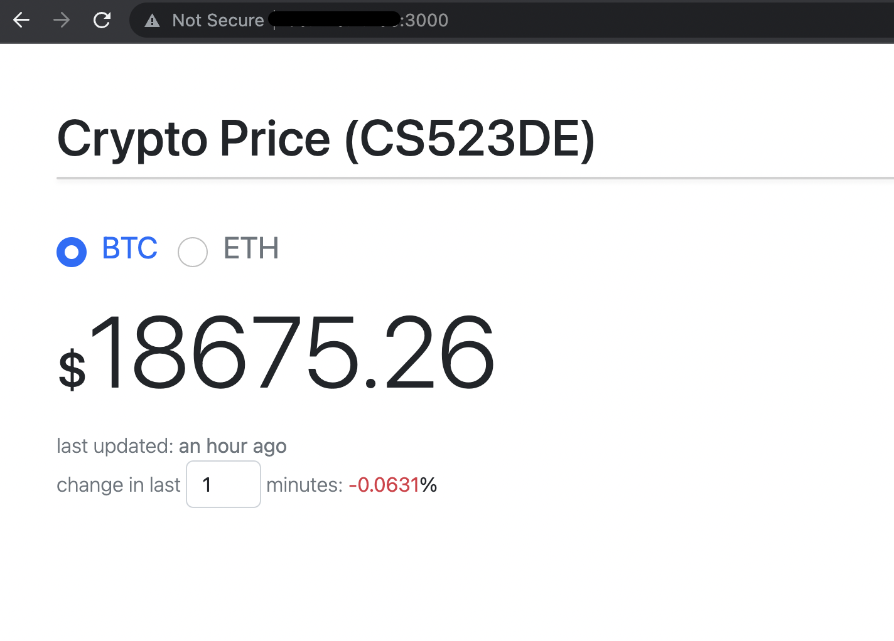

# CS523DE The Final Project

# Topic
Crypto price real-time streaming

# Intro
This is a tiny and simple project designed to demonstrate real-time streaming with big data technology in its whole life cycle. Basically, the whole process of the project is ingesting crypto coin price data from a Crypto Price Streaming service to a big data cluster, then showing a small real-time analysis on the data.

# Part 1
1. Sample code to subscribe [Ably](https://ably.com/hub/ably-coindesk/crypto-pricing) Cryptocurrency Pricing service
    
        AblyRealtime realtime = new AblyRealtime("<your_key>");
        String chanName = "[product:ably-coindesk/crypto-pricing]eth:usd";
        Channel channel = realtime.channels.get(chanName);
        channel.subscribe(new MessageListener() {
        @Override
        public void onMessage(Message message) {
            System.out.println(message.data);
        }
        });

2. Produce Kafka messages to a topic
        @Autowired
        private KafkaTemplate<String, String> kafkaTemplate;

        @Value(value = "${kafka.topicName}")
        private String topicName;
        
        public void send(String message){
            kafkaTemplate.send(topicName, message);
        }

3. The command to run the producer application
    
        java -jar <path_to_jar>/KafkaProducer-0.0.1-SNAPSHOT.jar edu.miu.cs523.KafkaProducerStreamReceiverApplication

4. We can check kafka topic with the following command
    
        ~/kafka/bin/kafka-console-consumer.sh --bootstrap-server localhost:9092 --topic cryptoprice --from-beginning

# Part 2
1. Code sample to consume the kafka topic and save to a HBase table
		
        SparkConf sparkConf = new SparkConf().setMaster("local[*]").setAppName("CryptopriceKafkaToHbase");
        JavaSparkContext jsc = new JavaSparkContext(sparkConf);

        // Kafka configuration
        Map<String, Object> kafkaParams = new HashMap<>();
        kafkaParams.put("bootstrap.servers", "localhost:9092");
        kafkaParams.put("key.deserializer", StringDeserializer.class);
        kafkaParams.put("value.deserializer", StringDeserializer.class);
        kafkaParams.put("group.id", "gid1");
        kafkaParams.put("auto.offset.reset", "latest");
        kafkaParams.put("enable.auto.commit", true);

        Collection<String> topics = Arrays.asList("cryptoprice");

        try {
            JavaStreamingContext jssc =
                    new JavaStreamingContext(jsc, new Duration(1000));

            JavaInputDStream<ConsumerRecord<String, String>> stream =
                    KafkaUtils.createDirectStream(
                            jssc,
                            LocationStrategies.PreferConsistent(),
                            ConsumerStrategies.Subscribe(topics, kafkaParams)
                    );

            JavaDStream<String[]> javaDstream = stream.map(x-> x.value().split(" "));

            JavaDStream<String[]> filtered = javaDstream.filter(record -> record.length >= 3);
            
            // HBase configuration
            Configuration conf = HBaseConfiguration.create();
            conf.addResource(new Path("/etc/hadoop/conf.cloudera.hdfs/core-site.xml"));
            conf.addResource(new Path("/etc/hbase/conf.cloudera.hbase/hbase-site.xml"));

            JavaHBaseContext hbaseContext = new JavaHBaseContext(jsc, conf);
            
            hbaseContext.streamBulkPut(filtered,
                    TableName.valueOf(TABLE_NAME),
                    new PutFunction());
            
            jssc.start();
            try {
                jssc.awaitTermination();
            } catch (InterruptedException e) {
                e.printStackTrace();
            }
        } finally {
            jsc.stop();
        }

        public static class PutFunction implements Function<String[], Put> {

            private static final long serialVersionUID = 1L;

            @Override
            public Put call(String[] data) {
                String datetime = data[0];
                String currency = data[1];
                Double price = Double.valueOf(data[2]);
                
                Put put = new Put(Bytes.toBytes(data[1] + "_" + data[0]));
                put.addColumn(Bytes.toBytes("price"), Bytes.toBytes("datetime"), Bytes.toBytes(datetime));
                put.addColumn(Bytes.toBytes("price"), Bytes.toBytes("currency"), Bytes.toBytes(currency));
                put.addColumn(Bytes.toBytes("price"), Bytes.toBytes("price"), Bytes.toBytes(price));
                
                return put;
            }
        }

2. We can build the project into single jar, contains its all dependencies with maven build. Otherwise we will have to submit all spark streaming packages to `spark-submit`.

        mvn clean compile assembly:single

3. Before doing deployment we need to create HBase table
   
        hbase shell
        create 'cryptoprice', 'price'

4. Deploy the application jar to spark. I used local mode. To deploy with client mode we need to install spark v2 in CDH.
    * run SparkStreaming+Kafka to HBase (local)
        
            java -jar <path_to_jar>/KafkaConsumerHBase-0.0.1-SNAPSHOT-jar-with-dependencies.jar \
            edu.miu.cs523.KafkaConsumerHBase.Main

    * run SparkStreaming+Kafka to HBase (yarn client mode)
        
            export JAVA_HOME=/usr/lib/jvm/jre-1.8.0-openjdk.x86_64 && \
            export HADOOP_CONF_DIR=$HADOOP_HOME/etc/hadoop && \
            export YARN_CONF_DIR=$HADOOP_HOME/etc/hadoop && \
            export SPARK_KAFKA_VERSION=0.10 && \
            spark-submit \
            --class edu.miu.cs523.Main \
            --master yarn \
            --deploy-mode client \
            <path_to_jar>/KafkaToHBase-0.0.1-SNAPSHOT-jar-with-dependencies.jar

# Part 3
1. To make some analysis on data with apache impala, first we need to create a hive external table
        
        hive> DROP TABLE IF EXISTS hbaseCryptoPrice;

        CREATE EXTERNAL TABLE hbaseCryptoPrice (
            id string,
            currency string,
            price double,
            ts string)
        STORED BY 'org.apache.hadoop.hive.hbase.HBaseStorageHandler'
        WITH SERDEPROPERTIES (
        "hbase.columns.mapping" =
        ":key,price:currency,price:price#b,price:datetime"
        )
        TBLPROPERTIES("hbase.table.name" = "cryptoprice");

2. Run the client web applicaiont
   1. cd <path_to_expressjs_project>
   2. npm install
   3. npm run
   
3. Open a web, goto url: http://localhost:3000
   
    
    

# Contents
* [Presentation slides](/CS523DE%20Final%20Project.pdf "Slides").
* [Used shell scripts](/shell_scripts.sh "Shell scripts").
* [Input/Output samples](/input_output/ "i/o").
* [Recorded demo](https://web.microsoftstream.com/video/b28bacc1-5ae3-41c7-ac78-f73a0055a820)